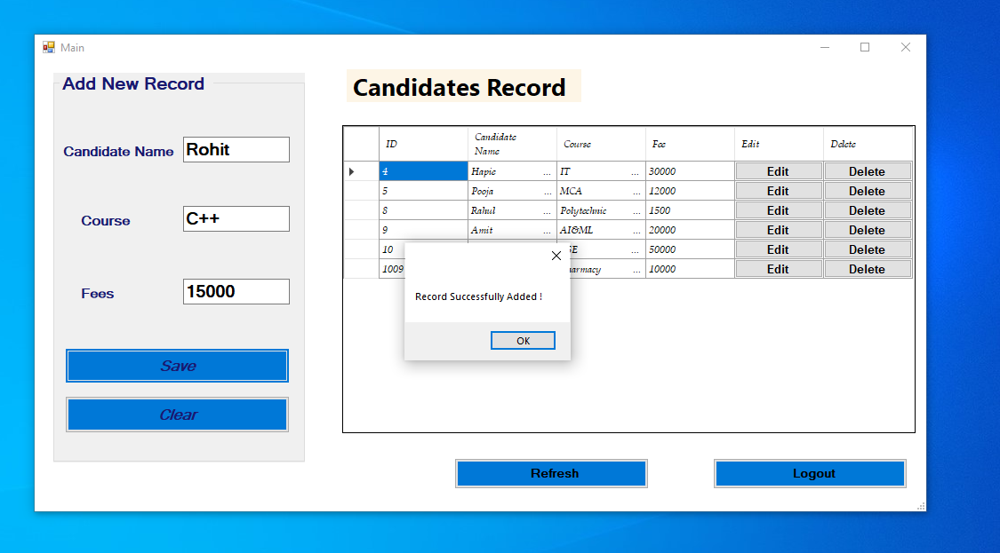
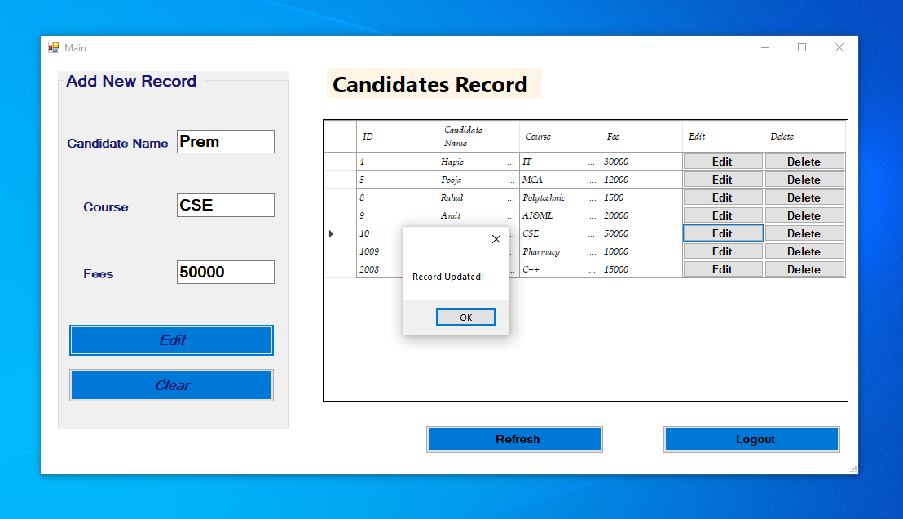
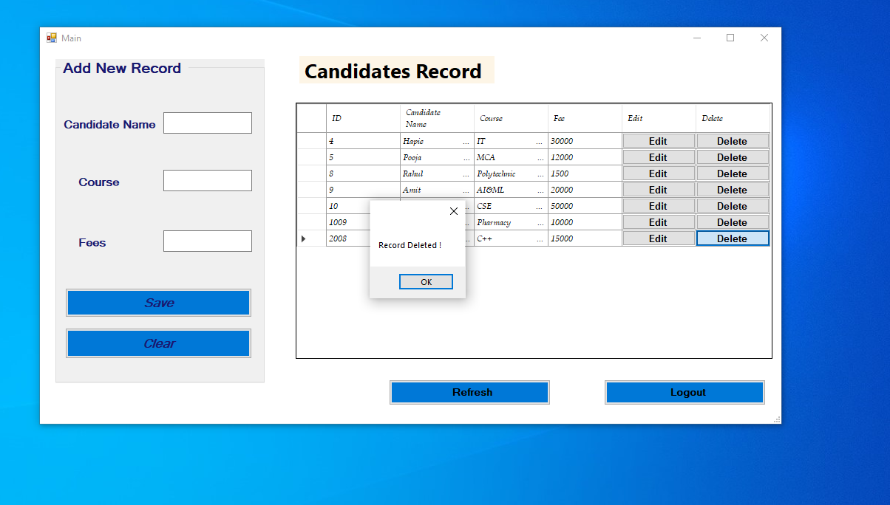

# Candidate-Fee-Record-System
I created Candidate Fee Record System which is a Windows Form Application using the Visual Studio and C# to manage fee records using SQL.
<h2>Features of Application</h2>
<h3>
Login Page  
Candidate Records Display 
Add Record  
Edit Record  
Delete Record  
Logout Page  
</h3>
 
<h2>Functionalities</h2>
 
<h3>Login Page</h3>

 
<h3>Login Failed Page</h3>

 
  <h3>Fee Record Page</h3>

 
  <h3>ADD RECORD</h3>

 
  <h3>EDIT</h3>

 
  <h3>DELETE</h3>

 
  <h3>DELETE</h3>

<h2>Tecnologies Stack</h2>
Visual Studio(.NET Framework), C#, Windows Form Application,Microsoft SQL Server Studio 2018 
